# 🛍️ CampusShop

**CampusShop** es una aplicación web orientada a la compra de productos universitarios, diseñada para ofrecer una experiencia intuitiva, rápida y responsive para estudiantes.

---

## 📁 Estructura del Proyecto

El proyecto sigue una organización modular basada en separación de responsabilidades:

📦 CampusShop
---
├── 📄 index.html          # Página de inicio
---
├── 📄 catalogo.html       # Catálogo de productos con filtros

├── 📄 producto.html       # Vista detallada de productos

├── 📄 carrito.html        # Carrito de compras

├── 📄 checkout.html       # Proceso de pago

├── 📄 perfil.html         # Información del usuario

├── 📄 historial.html      # Historial de compras

├── 📄 vacio.html          # Estado vacío del carrito
│

├── 📁 css
---
│   ├── base.css          # Variables globales (colores, tipografía)

│   ├── layout.css        # Estructura general (header, footer, grid)

│   ├── components.css    # Componentes reutilizables (cards, botones)

│   └── responsive.css    # Adaptación a dispositivos móviles

│
---
├── 📁 img                # Recursos gráficos del proyecto
---
└── 📄 README.md
---

---

## 🧭 Navegación entre Vistas

La aplicación está diseñada para seguir un flujo claro de usuario dentro de un entorno e-commerce:

### 1. 🏠 Inicio (`index.html`)
- Barra de navegación global
- Buscador de productos
- Categorías principales (Ropa, Papelería, Tech, Accesorios)
- Productos destacados

### 2. 🛒 Catálogo (`catalogo.html`)
- Sidebar de filtros:
  - Categorías (checkbox)
  - Rango de precios (slider)
- Grid de productos con:
  - Imagen
  - Nombre
  - Precio
  - Botón de acceso a detalle

### 3. 📦 Producto (`producto.html`)
- Vista detallada con:
  - Imagen principal
  - Descripción completa
  - Variantes (talla, color, capacidad)
  - Selector de cantidad
  - Botón “Añadir al carrito”
- Navegación por anclas (`#producto`) para múltiples productos en una misma página

### 4. 🧺 Carrito (`carrito.html`)
- Listado de productos añadidos
- Controles:
  - Incrementar/disminuir cantidad
  - Eliminar producto
- Resumen de compra:
  - Subtotal
  - Envío
  - Total
- Acciones:
  - Finalizar compra
  - Continuar comprando

### 5. 💳 Checkout (`checkout.html`)
- Formulario de datos de envío y pago
- Confirmación de compra

### 6. 👤 Perfil (`perfil.html`)
- Información del usuario
- Acceso al historial

### 7. 📜 Historial (`historial.html`)
- Registro de compras realizadas

### 8. 📭 Carrito Vacío (`vacio.html`)
- Estado visual cuando no hay productos en el carrito

---

## 🧩 Arquitectura y Decisiones Técnicas

- HTML semántico para mejorar accesibilidad y SEO
- CSS modularizado para escalabilidad y mantenimiento
- Diseño responsive adaptado a diferentes dispositivos
- Componentización visual (cards, botones, grids reutilizables)
- Navegación consistente mediante navbar global

---

## 📸 Comparación: Mockups vs Implementación

A continuación se presenta la comparación entre el diseño inicial (mockup) y la implementación final del sistema:

### 🏠 Vista de Inicio
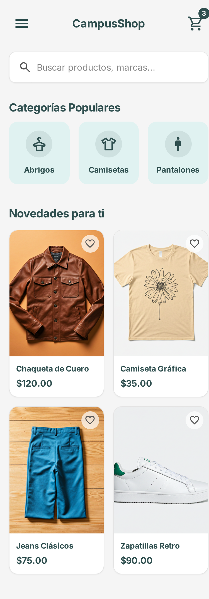
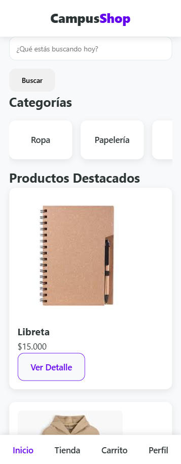

### 🛒 Vista de Catálogo
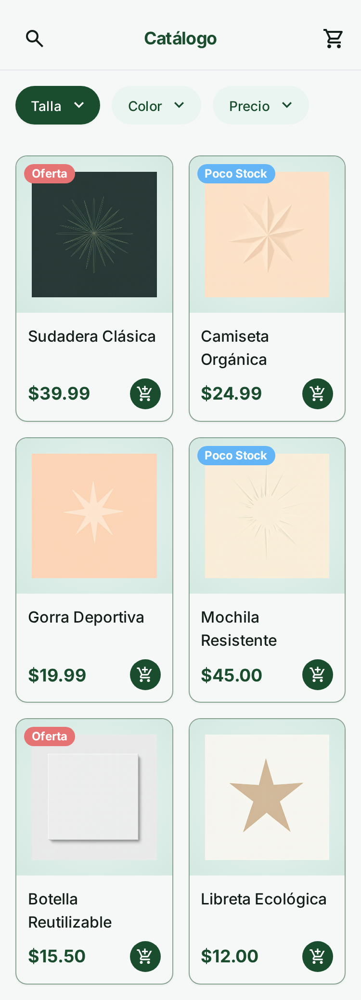
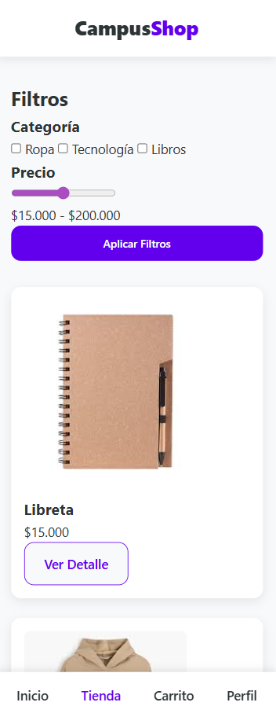

### 📦 Vista de Producto
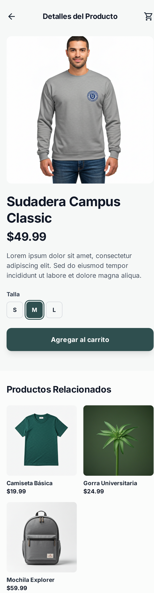
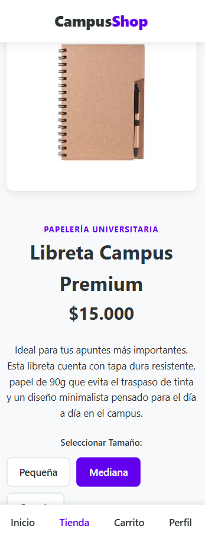

### 🧺 Vista de Carrito
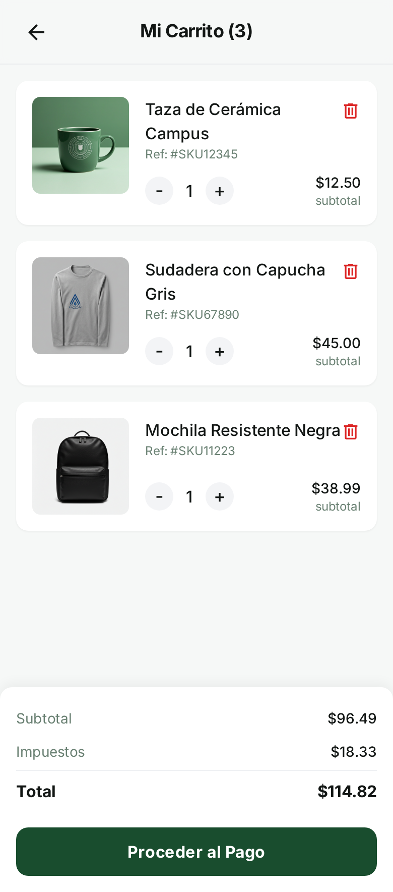
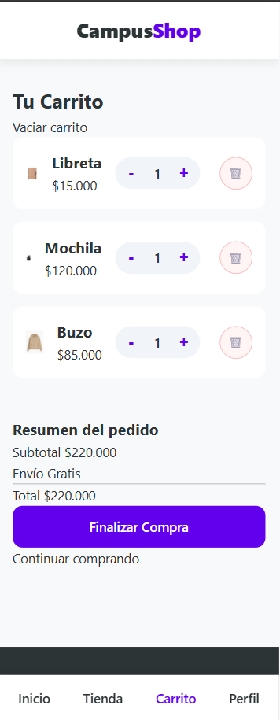

### 💳 Vista de Checkout
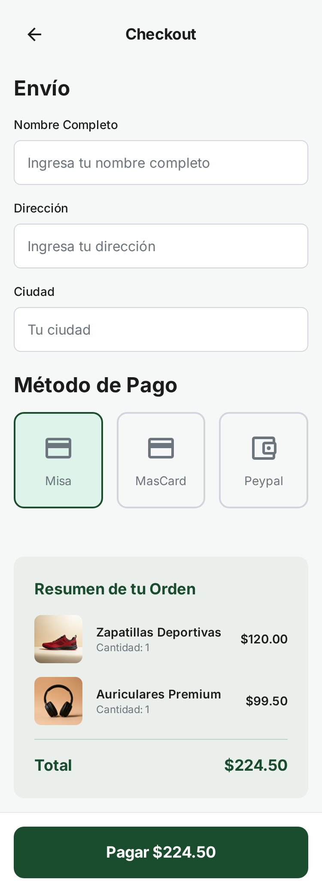
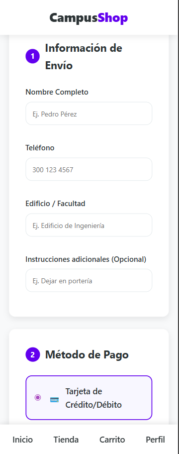

### 👤 Vista de Perfil
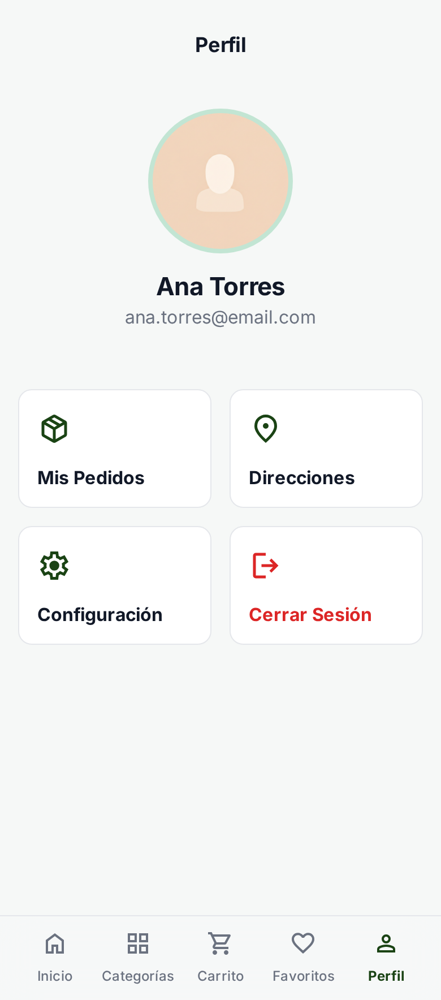
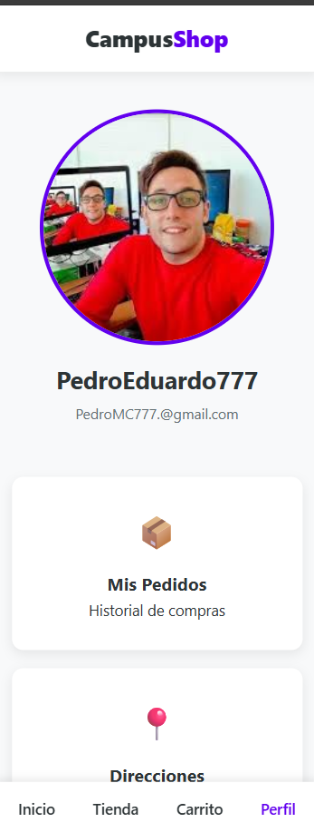

### 📜 Vista de Historial
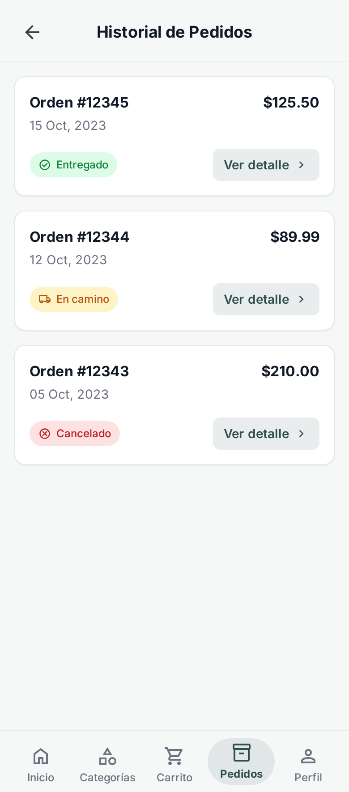
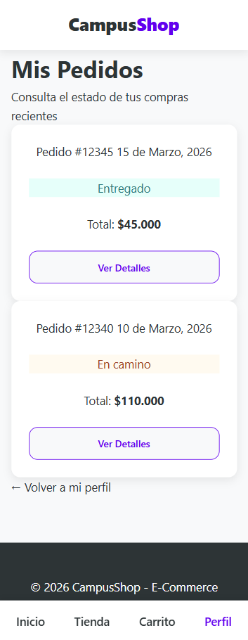

### 📭 Vista de Carrito Vacío
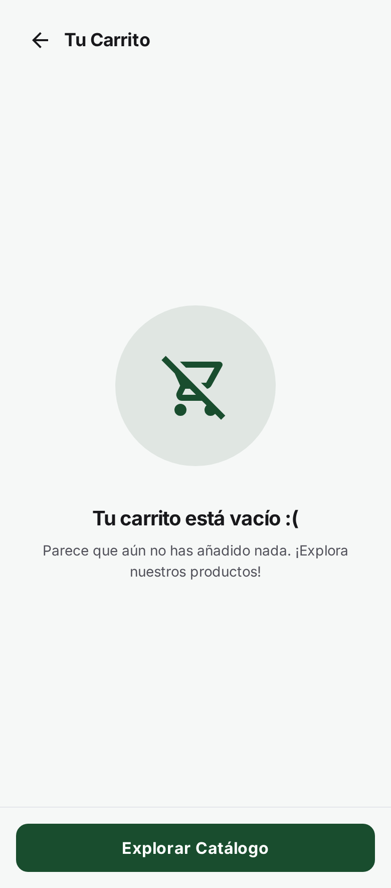
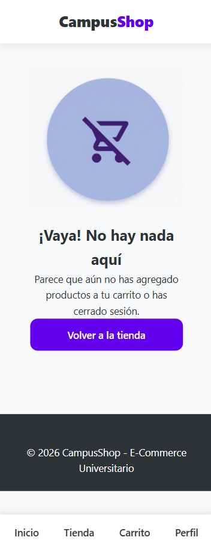

---
Keynner Alonso Sanchez Ortiz